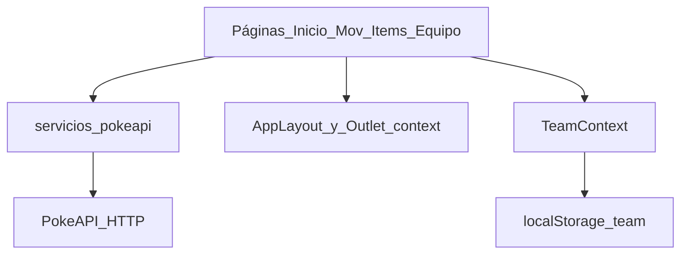

# Pokédex Nacional
## De Vanilla JS a React + TypeScript

**Diseño Web — 2.º parcial**  
Fuente de datos: **PokeAPI**

---

## Objetivo de la migración

- Mantener **la misma experiencia** (UI + flujos).
- Cambiar la **arquitectura** a componentes, rutas y estado declarativo.
- Documentar **qué se conserva** y **qué evoluciona**.

---

## Qué se conserva (similitudes)

- **4 secciones**: Inicio, Movimientos, Ítems, Mi equipo.
- **Scroll infinito** en Inicio + skeletons.
- **Búsqueda** local + fallback a API.
- **Modales** de detalle con overlay y Escape.
- **Tema** claro/oscuro + `localStorage`.
- **Equipo** (6 máx.) + apodos.

---

## Vanilla: cómo está armado

- Varios archivos **HTML** + un **`app.js`** grande.
- `init()` decide la página con `data-page`.
- **DOM imperativo**: `innerHTML`, `appendChild`, listeners.

---

## React: cómo está armado

- **Vite** + **React** + **TypeScript**.
- **React Router** para rutas internas.
- **JSX** + hooks (`useState`, `useEffect`, …).
- **Contexto** (`TeamProvider`) para el equipo compartido.

---

## Flujo de datos (React)



---

## Cambios clave (resumen)

| Tema | Vanilla | React |
|------|---------|-------|
| Navegación | HTML múltiple | SPA + rutas |
| Estado | Objetos locales | Hooks + contexto |
| UI | Strings HTML | Componentes JSX |
| Build | Opcional | `vite build` |

---

## Archivos “equivalentes”

- `pokedex-app/app.js` → `src/pages/*` + `src/services/pokeapi.ts`
- `pokedex-app/*.html` → `src/App.tsx` + rutas
- `pokedex-app/styles.css` → `src/styles/globals.css`

---

## Cómo ejecutarlo

```bash
cd pokedex-app-React
npm install
npm run dev
```

Abre la URL que muestra Vite (por defecto `http://localhost:5173`).

---

## Conclusión

React **no cambia el producto** para el usuario final: cambia **cómo organizamos** el código para escalar, tipar y mantener el proyecto.

**Entregables**: `DOCUMENTO.md`, `WALKTHROUGH_CODIGO.md`, `GUIA_PASO_A_PASO.md`.
