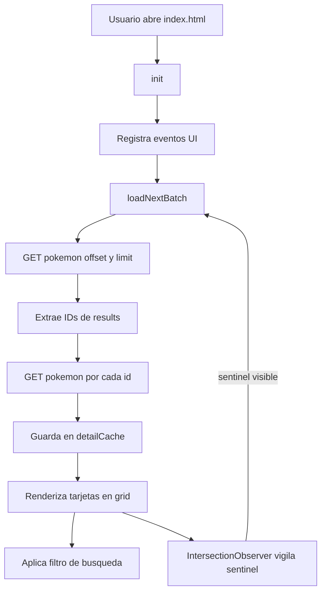

# Manual Walkthrough — Pokédex Nacional

Guía breve para entender **cómo está construida** esta aplicación web (HTML + CSS + JavaScript sin frameworks). Ideal para ver en clase: **API**, **paginación infinita**, **búsqueda** y **detalle en modal**.

---

## 1. Mapa mental (¿qué pasa al abrir la página?)

1. El navegador carga `index.html` y al final ejecuta `app.js` (con `defer`).
2. `init()` registra eventos (tema, búsqueda, clics, modal, scroll infinito) y llama **una vez** a `loadNextBatch()`.
3. `loadNextBatch()` pide a **PokeAPI** un **lote** de nombres/URLs (`offset` + `limit`), extrae los **IDs**, pide el **detalle** de cada Pokémon y pinta **tarjetas** en `#pokemon-grid`.
4. Mientras bajas con el scroll, un elemento invisible al final (`#sentinel`) avisa al navegador: “ya casi llego al fondo” → se pide **otro lote**.

**Idea clave:** la lista de la API solo trae “pistas”; el **detalle rico** (tipos, stats, etc.) viene de otra URL por cada Pokémon.

---

## 2. Base del proyecto (HTML + referencias en JS)

Archivo principal: `index.html`.

| Elemento (id)        | Para qué sirve |
| -------------------- | -------------- |
| `#pokemon-grid`      | Contenedor donde se agregan las tarjetas (rol `list`). |
| `#sentinel`          | “Hito” al final del grid; el scroll infinito lo observa. |
| `#search-input`      | Campo de búsqueda por nombre. |
| `#error-banner`      | Mensaje visible si falla la red o el servidor. |
| `#modal` / overlay   | Ventana de detalle (stats, habilidades, etc.). |

En `app.js`, el objeto `els` guarda referencias a esos nodos con `document.getElementById(...)`. Así el resto del código no repite búsquedas en el DOM.

---

## 3. Llamar a la API de forma clara y segura

**Base de la API:**

```text
https://pokeapi.co/api/v2
```

**Dos tipos de petición que usa esta app:**

| Objetivo | URL (ejemplo) | Respuesta útil |
| -------- | --------------- | -------------- |
| Lista paginada | `GET .../pokemon?offset=0&limit=20` | `results[]` con `name` y `url` de cada ítem. |
| Detalle de uno | `GET .../pokemon/25` (o nombre) | `id`, `name`, `types`, `stats`, `height`, `weight`, etc. |

La función `fetchJson(url)` encapsula el patrón estándar:

1. `fetch(url)` → petición HTTP asíncrona.
2. Si `!res.ok` (404, 500, etc.) → se lanza un error con el código HTTP.
3. Si todo va bien → `res.json()` devuelve el objeto JavaScript.

**Por qué importa:** separas “hablar con la red” de “pintar la pantalla”. Si falla, puedes mostrar el banner de error sin mezclar lógica en cada botón.

**Fragmento real** (`app.js`):

```javascript
async function fetchJson(url) {
  const res = await fetch(url);
  if (!res.ok) {
    const err = new Error(`HTTP ${res.status}`);
    err.status = res.status;
    throw err;
  }
  return res.json();
}
```

---

## 4. Paginación infinita (offset, limit y el “sentinel”)

### Estado en memoria (`state`)

- `offset`: desde qué Pokémon “empieza” el siguiente lote en la API.
- `limit`: cuántos pide cada vez (aquí **20**).
- `hasMore`: si aún puede haber más páginas.
- `isLoading`: evita disparar **dos cargas a la vez** si el usuario scrollea muy rápido.

### Flujo de `loadNextBatch()`

1. Si ya está cargando o no hay más → **sale** (no duplica trabajo).
2. Pone `isLoading = true`, muestra **skeletons** (placeholders animados).
3. Pide la lista: `.../pokemon?offset=${state.offset}&limit=${state.limit}`.
4. De cada `result.url` saca el **ID** con `extractIdFromPokemonUrl` (el número al final de la URL).
5. Para cada ID, pide `.../pokemon/${id}` en paralelo (`Promise.all`).
6. Guarda cada respuesta en `state.detailCache` (un `Map` id → datos crudos).
7. Agrega IDs nuevos a `state.pokemonList`, renderiza tarjetas, suma `offset += limit`.
8. Si el lote vino con menos de `limit` ítems → `hasMore = false` (ya no hay siguiente página).

### IntersectionObserver (scroll infinito sin botón)

Un `IntersectionObserver` vigila `#sentinel`. Cuando el sentinel **entra en vista** (o está cerca, por `rootMargin: "200px"`), llama a `loadNextBatch()`.

**Analogía para alumnos:** el sentinel es como un sensor al final del pasillo: cuando tu ojo (el viewport) lo alcanza, la app dice “trae el siguiente grupo de Pokémon”.

**Ideas clave en código** (`app.js`):

- URL del lote (paginación clásica `offset` / `limit`):

```javascript
const listUrl = `${API_BASE}/pokemon?offset=${state.offset}&limit=${state.limit}`;
const listData = await fetchJson(listUrl);
```

- Observer que dispara la siguiente carga:

```javascript
const observer = new IntersectionObserver(
  (entries) => {
    for (const entry of entries) {
      if (entry.isIntersecting) {
        loadNextBatch();
      }
    }
  },
  { root: null, rootMargin: "200px", threshold: 0 }
);
observer.observe(els.sentinel);
```

---

## 5. Búsqueda en tiempo real

- Al escribir en `#search-input`, el evento `input` actualiza `state.searchTerm`.
- `applySearchFilter()` recorre las tarjetas `.pokemon-card` y compara el nombre (en minúsculas, guardado en `data-name`) con el texto buscado.
- Si no coincide → clase `pokemon-card--hidden` (en CSS: `display: none`).

**Muy importante decirlo en clase:** esta búsqueda filtra solo entre los Pokémon **ya cargados en pantalla**. Si buscas algo que aún no entró por scroll, puede no aparecer hasta que **sigas bajando** y se carguen más lotes (el mensaje “empty state” lo explica).

**Lógica del filtro** (`app.js`): se normaliza el texto (`trim`, `toLowerCase`), se compara con `data-name` de cada tarjeta y se alterna la clase `pokemon-card--hidden` si no hay coincidencia (`name.includes(q)` cuando hay texto de búsqueda).

---

## 6. Detalle en modal (“Ver más”)

- Los clics se delegan en `#pokemon-grid`: si el clic fue en `.btn-details`, se lee `data-id` y se llama `openModal(id)`.
- Si el detalle ya está en `detailCache`, no se vuelve a pedir a la red.
- Si no, `fetchJson` a `.../pokemon/${id}` y luego `renderModalDetail` arma el HTML (stats como barras, habilidades, altura/peso).

**Accesibilidad mínima que enseña buen hábito:** foco al cerrar vuelve al botón que abrió, `Escape` cierra, `aria-modal` en el diálogo.

**Delegación de clics** (un solo listener en la cuadrícula):

```javascript
els.grid.addEventListener("click", (e) => {
  const btn = e.target.closest(".btn-details");
  if (!btn) return;
  const id = parseInt(btn.getAttribute("data-id"), 10);
  if (!Number.isFinite(id)) return;
  openModal(id);
});
```

---

## 7. Diagrama de flujo (resumen visual)



---

## 8. Buenas prácticas que ya trae el proyecto

| Idea | Dónde / por qué |
| ---- | ---------------- |
| **Cache** (`Map`) | Evita repetir `fetch` del mismo Pokémon al abrir el modal. |
| **Skeleton loaders** | Da feedback de “está cargando” sin bloquear la UI. |
| **`escapeHtml`** | Reduce riesgo al meter texto de la API en HTML. |
| **`loading="lazy"`** en imágenes de lista | Mejor rendimiento al hacer scroll. |
| **Temas** | `data-theme` + `localStorage` para recordar claro/oscuro. |

---

## 9. Mini retos para alumnos (sin dar la solución completa)

1. **Buscar por número:** si el usuario escribe solo dígitos, resaltar o filtrar por `#` de Pokédex nacional.
2. **Botón “Cargar más”:** además del scroll, un botón que llame a `loadNextBatch()` (útil si el observer falla en algún navegador viejo).
3. **Contador:** mostrar en el encabezado “Mostrando X Pokémon cargados”.
4. **Filtro por tipo:** usando los `data-` o los tipos ya en la tarjeta, ocultar los que no sean del tipo elegido (requiere pensar en UI: un `<select>` de tipos).

---

## 10. Cómo ejecutar el proyecto en clase

Ver también `README.md`. Resumen:

- Abrir `index.html` en el navegador, o
- Servidor estático: `cd pokedex-app && python3 -m http.server 8080` y entrar a `http://localhost:8080` (útil si `fetch` con `file://` da problemas).

---

## Archivos y responsabilidad

| Archivo | Rol |
| ------- | --- |
| `index.html` | Estructura, ids para JS, modal, accesibilidad básica. |
| `styles.css` | Tema, grid, tarjetas, skeleton, modal, estado oculto de búsqueda. |
| `app.js` | Estado, `fetch`, lotes, búsqueda, modal, observer. |

Con esto tienes el **hilo conductor** de la Pokédex: **API → estado → DOM → eventos → más API**. Eso es el núcleo de muchas apps web modernas, aquí explicado en versión “vanilla” ideal para prepa.
